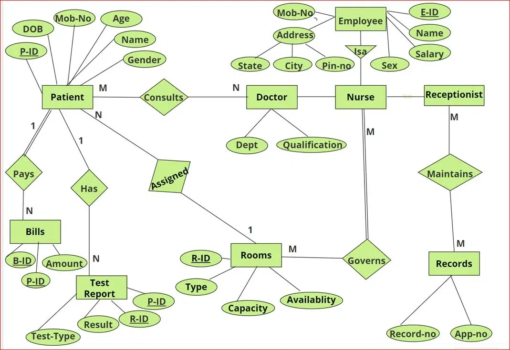

# Hospital Management Database

## 📌 Project Overview
The **Hospital Management Database** is designed to efficiently manage hospital operations, including patient records, employee details, room allocations, billing, and test reports. The database structure follows **Entity-Relationship (ER) modeling** and ensures data integrity through relationships and constraints.

---

## 🏥 Features & Functionalities
- **Patient Management:** Store and retrieve patient details.
- **Employee Records:** Maintain doctor, nurse, and receptionist data.
- **Room Allocation:** Track room availability and occupancy.
- **Billing System:** Generate and manage patient bills.
- **Medical Test Reports:** Store and link patient test results.
- **Relational Integrity:** Multiple relationships among entities.

---

## 📊 ER Diagram


The **ER Diagram** represents all entities, attributes, and relationships in the system.

---

## 🗄️ Database Schema
The database consists of the following tables:
- **Patient (P_ID, Name, DOB, Gender, Mobile, Age)**
- **Employee (E_ID, Name, Salary, Gender, Mobile, Address, State, City, Pin_Code)**
- **Doctor (E_ID, Department, Qualification)**
- **Nurse (E_ID, Assigned_Rooms)**
- **Room (R_ID, Type, Capacity, Availability)**
- **Receptionist (E_ID)**
- **Test_Report (R_ID, P_ID, Test_Type, Result)**
- **Bill (B_ID, P_ID, Amount)**
- **Records (Record_No, App_No)**

---

## 🔗 Relationship Tables
- **Patient-Doctor (P_ID, E_ID)**
- **Nurse-Room (E_ID, R_ID)**
- **Receptionist-Records (E_ID, Record_No)**
- **Patient-Bill (P_ID, B_ID, Amount)**
- **Patient-Test_Report (P_ID, R_ID, Test_Type, Result)**
- **Room-Patient (R_ID, P_ID, Stay_Start, Stay_End)**

---

## 💻 SQL Scripts
- **DDL (Data Definition Language):** Table creation scripts (`database_schema.sql`)
- **DML (Data Manipulation Language):** Data insertion queries (`insert_data.sql`)
- **Queries:** Predefined SQL queries for retrieving hospital data (`queries.sql`)

---

## 🚀 How to Run the Database
### 1️⃣ Clone the Repository
```sh
git clone https://github.com/yourusername/Hospital-Management_DB.git
cd Hospital-Management_DB
```

### 2️⃣ Import the Database
- Open **MySQL Workbench** or any SQL client.
- Execute the `database_schema.sql` file to create tables.
- Run `insert_data.sql` to populate the database.

### 3️⃣ Query the Database
Run predefined queries in `queries.sql` to test the database.

---

## 📂 Project Structure
```
Hospital-Management_DB/
│── database_schema.sql
│── insert_data.sql
│── queries.sql
│── ER_Diagram.png
│── README.md
```

---

## 🏆 Contributors
- **[Mayank Singh Negi](https://github.com/MayankSNegi)** - Database Design & SQL Implementation
---

## 📜 License
This project is **open-source** and free to use.
